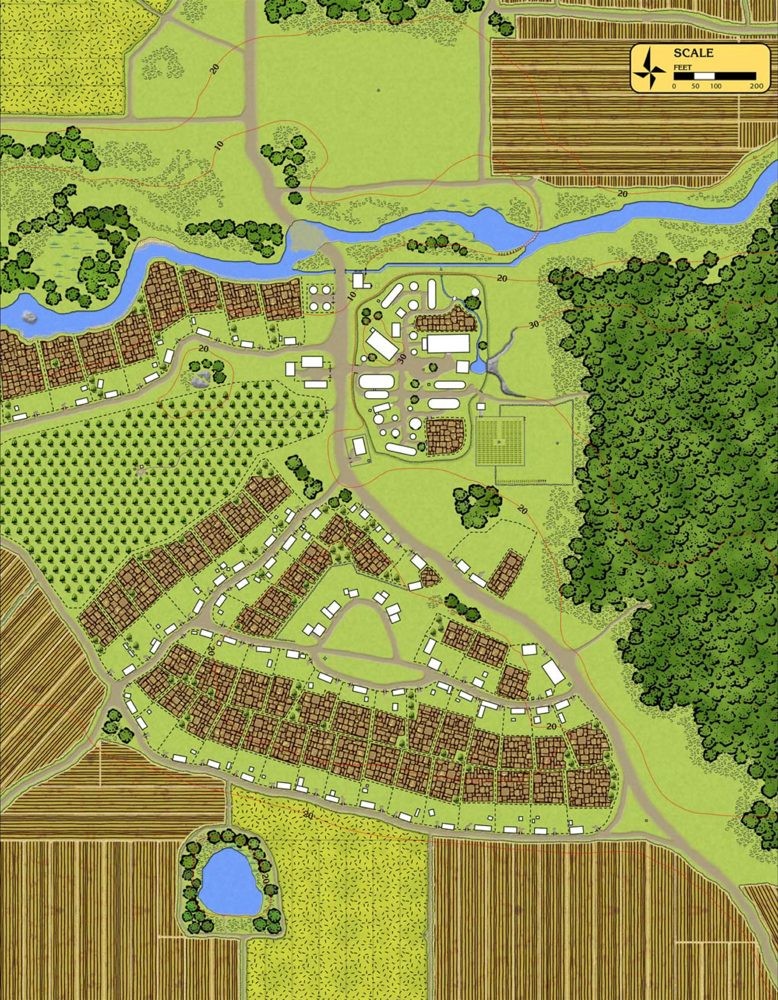
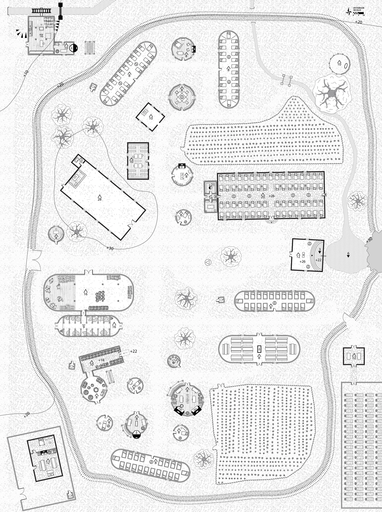

# HârnWorld Location Module: Erone Abbey

Erone Abbey is a "Location Module"; it is designed to depict the Erone Abbey and
village located just south of Tashal, kingdom of Kaldor, on
the island of Hârn in the [HârnWorld](https://columbiagames.com/harnworld/) fantasy
setting; however, this abbey could be adapted to exist anywhere in any fantasy setting.

Although designed for use with the [HârnMaster](https://foundryvtt.com/packages/hm3)
system, this module is mostly system-agnostic.  Detailed descriptions of the actors
has been provided in journal entries to facilitate conversion to other game systems.

The abbey is held by the Peonian Pelnala Velira Siwen, abbess of Erone.  Erone Abbey
is widely known as a place of healing and peace, and the waters of its natural hot
springs are widely considered therapeutic.  

# Maps

The original maps from this work have been used as is.  The following
maps are part of this module.

## Erone Village

Map of Erone Village, including the abbey.

## Erone Abbey

Map of Erone abbey.

# Credits

This module is made possible by the hard work of HârnWorld fans,
and is provided at no cost. This work is an adaptation of the article
[Charmic Manor]()https://www.lythia.com/harnworld/settlements/charmic/ available
at the HârnWorld fan site [Lythia.com](https://www.lythia.com/).

**Writer:** Kerry Mould

**Contributors:** Joe Adams, Dave St. Pierre, John Sgammato

**Maps:** Dave St. Pierre

**Artist:** Richard Luschek

**Adapted to Foundry VTT:** Tom Rodriguez

This module is "[Fanon](https://www.lythia.com/about/publishing-fan-written-material/)",
a derivative work of copyrighted material by Columbia Games Inc. and N. Robin Crossby.

Illustrations by Richard Luschek; visit his Patreon page at https://www.patreon.com/LuschekII.
